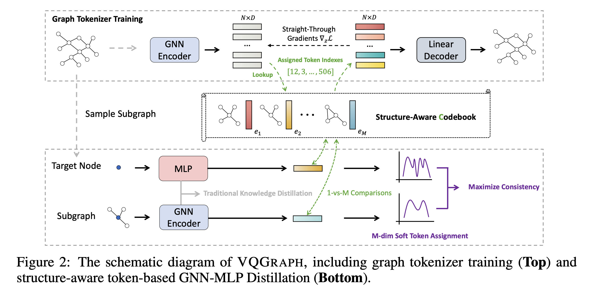
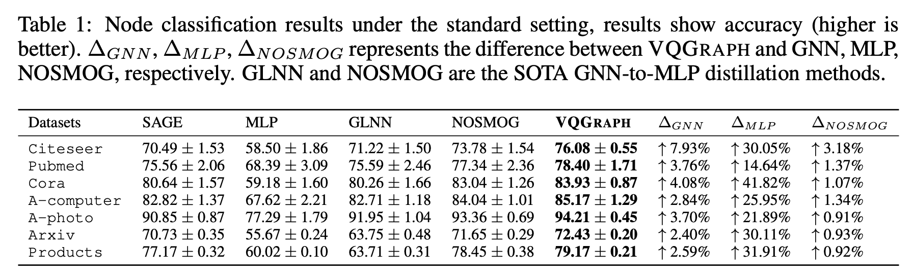
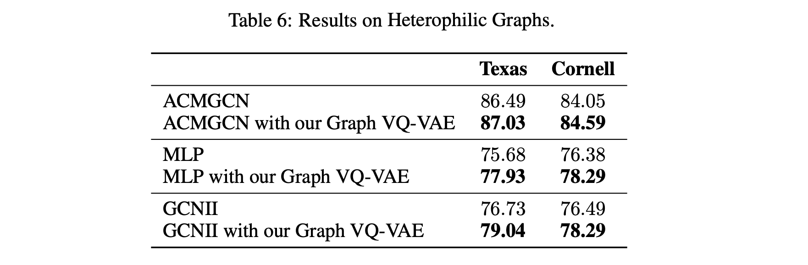

# ICLR 2024 - VQGraph: Rethinking Graph Representation Space for Bridging GNNs and MLPs
<a href="https://openreview.net/forum?id=h6Tz85BqRI"></a>

This repository is the official implementation of [VQGraph](https://openreview.net/forum?id=h6Tz85BqRI) **(ICLR 2024)**. 
VQGraph is the state-of-the-art (SOTA) GNN-to-MLP distillation method.

>[**VQGraph: Rethinking Graph Representation Space for Bridging GNNs and MLPs**](https://openreview.net/forum?id=h6Tz85BqRI).  
>[Ling Yang](https://yangling0818.github.io/), 
>[Ye Tian](),
>[Minkai Xu](https://minkaixu.com/),
>[Zhongyi Liu](),
>[Shenda Hong](https://hsd1503.github.io/),
>[Wei Qu](),
>[Wentao Zhang](https://zwt233.github.io/),
>[Bin Cui](https://cuibinpku.github.io/),
>[Muhan Zhang](https://muhanzhang.github.io/),
>[Jure Leskovec](https://cs.stanford.edu/~jure/)
<br>**Peking University, Stanford University**<br>


## Overview


**Abstract**: GNN-to-MLP distillation aims to utilize knowledge distillation (KD) to learn computationally-efficient multi-layer perceptron (student MLP) on graph data by mimicking the output representations of teacher GNN. Existing methods mainly make the MLP to mimic the GNN predictions over a few class labels. However, the class space may not be expressive enough for covering numerous diverse local graph structures, thus limiting the performance of knowledge transfer from GNN to MLP. To address this issue, we propose to learn a new powerful graph representation space by directly labeling nodes' diverse local structures for GNN-to-MLP distillation. Specifically, we propose a variant of VQ-VAE to learn a structure-aware tokenizer on graph data that can encode each node's local substructure as a discrete code. The discrete codes constitute a codebook as a new graph representation space that is able to identify different local graph structures of nodes with the corresponding code indices. Then, based on the learned codebook, we propose a new distillation target, namely soft code assignments, to directly transfer the structural knowledge of each node from GNN to MLP. The resulting framework VQGraph achieves new state-of-the-art performance on GNN-to-MLP distillation in both transductive and inductive settings across seven graph datasets. We show that VQGraph with better performance infers faster than GNNs by 828×, and also achieves accuracy improvement over GNNs and stand-alone MLPs by 3.90% and 28.05% on average, respectively.

## Model Performance

**Node Classification**


**Extend VQGraph to Heterophilic Graphs**



## Preparation
```bash
conda create -n vqgraph python=3.9
conda activate vqgraph
pip install -r requirements.txt
```

<!-- ## Requirements 


---
* torch >= 1.7.0
* ogb >= 1.3.3
* dgl >= 0.6.1
* networkx >= 2.5.1
* googledrivedownloader >= 0.4
* category_encoders >= 2.3.0
* einops >= 0.6.0
* pyyaml -->

## Datasets
Please download the datasets, and put them under `data/` (see below for instructions on organizing the datasets).

- *CPF data* (`cora`, `citeseer`, `pubmed`, `a-computer`, and `a-photo`): Download the '.npz' files from [here](https://www.dropbox.com/sh/fchrckrpf99gho2/AABZwMOeOnuiCxBjqYd46Qz3a?dl=0). Rename `amazon_electronics_computers.npz` and `amazon_electronics_photo.npz` to `a-computer.npz` and `a-photo.npz` respectively.

- *OGB data* (`ogbn-arxiv` and `ogbn-products`): Datasets will be automatically downloaded when running the `load_data` function in `dataloader.py`. Please refer to the OGB official website for more details.

## Training and Evaluation

**About GraphSage**
Our GraphSage implementation primarily utilizes the  MultiLayerNeighborSampler in GraphSage data preparation, which internally employs local GCN. While both GraphSage and GCN can yield consistent results, we recommend using GCN as it tends to be easier to reproduce. GraphSage may require tweaking of **more rounds of parameter tuning** compared to GCN.


**Graph Tokenizer Training**: 
To quickly reproduce our teacher model and graph tokenizer, you can run `train_teacher.py` as the following example command:
```
python train_teacher.py --exp_setting tran --teacher GCN --dataset citeseer --output_path outputs --seed 0 --max_epoch 100 --patience 50 --device 0
```


Our pretrained codebook embeddings, teacher soft assignments and teacher soft labels for some datasets have been uploaded to [here](https://www.dropbox.com/scl/fo/9yss598aln21gzdiwix61/h?dl=0&rlkey=oscheo12z9md8uah7eakq62yj). Please download and put them under `outputs/transductive/{dataset}/GCN/` for GNN-MLP distillation.

**GNN-to-MLP Distillation**: After training the teacher model, you can run `train_student.py` for our distillation process by specifying the experiment setting, including teacher model, student model, output path of the teacher model and dataset like the following example command: 

```
python train_student.py --exp_setting tran --teacher GCN --student MLP --dataset citeseer --out_t_path outputs --seed 0 --max_epoch 500 --patience 50 --device 0
```

## Citation
If you found the codes are useful, please cite our paper
```
@inproceedings{yang2024vqgraph,
title={VQGraph: Rethinking Graph Representation Space for Bridging GNNs and MLPs},
author={Ling Yang and Ye Tian and Minkai Xu and Zhongyi Liu and Shenda Hong and Wei Qu and Wentao Zhang and Bin CUI and Muhan Zhang and Jure Leskovec},
booktitle={International Conference on Learning Representations},
year={2024}
}
```
